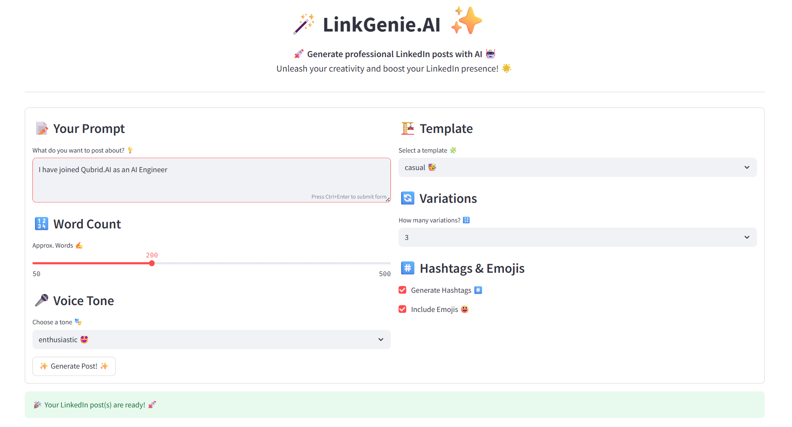
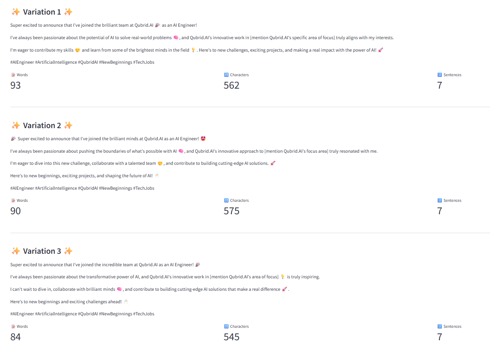
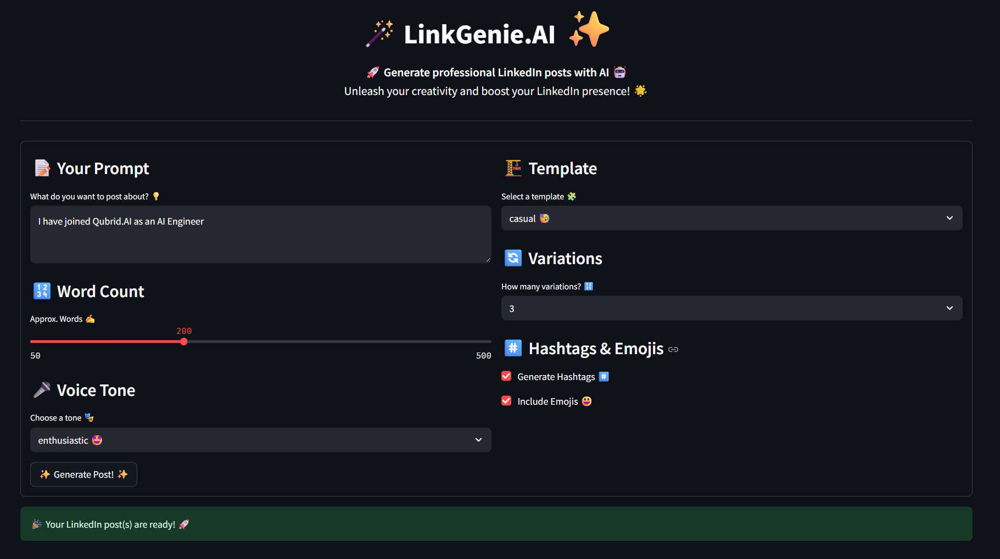
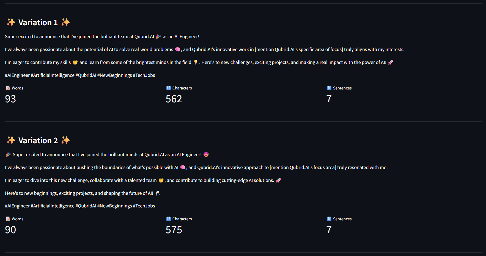

# LinkGenie.AI 🪄

[](LICENSE)
[](https://www.python.org/downloads/)
[](https://streamlit.io/)
[](https://flask.palletsprojects.com/)

Generate professional, engaging LinkedIn posts with AI assistance. Elevate your LinkedIn presence with customizable, high-quality content in seconds.

### 💻 App Interface Preview 
> Light Theme 🤍




> Dark Theme 🖤




## ✨ Features

- **AI-Powered Content Generation**: Leverage Groq's Gemma2-9b-it model for high-quality LinkedIn posts
- **Multiple Templates**: Choose from informative, casual, or inspirational post templates
- **Tone Customization**: Select from professional, friendly, enthusiastic, authoritative, or casual tones
- **Smart Hashtags**: Generate relevant hashtags to increase post visibility
- **Emoji Enhancement**: Add contextual emojis to make your posts more engaging
- **Multiple Variations**: Generate up to 3 variations of your post to choose from
- **Content Analysis**: View word count, character count, and sentence count for each generated post
- **Dual Interfaces**: Use the friendly Streamlit web interface or integrate via REST API

## 🚀 Getting Started

### Prerequisites

- Python 3.10 or higher
- Groq API key ([Get one here](https://console.groq.com/))

### Installation

1. Clone the repository:
   ```bash
   git clone https://github.com/yourusername/LinkGenie.AI.git
   cd LinkGenie.AI
   ```

2. Install dependencies:
   ```bash
   pip install -r requirements.txt
   ```

3. Configure your Groq API key:
   - Create a `.env` file with your API key:
     ```
     GROQ_API_KEY=your_api_key_here
     ```
   - For Streamlit, create a `.streamlit/secrets.toml` file:
     ```toml
     GROQ_API_KEY = "your_api_key_here"
     ```

### Running the Application

#### Streamlit Web Interface

```bash
streamlit run app.py
```

The application will be available at http://localhost:8501

#### Flask API Server

```bash
flask run
# or
python app.py
```

The API will be available at http://localhost:5000

## 🔌 API Usage

Generate LinkedIn posts programmatically using the REST API:

```bash
curl -X POST http://localhost:5000/generate \
  -H "Content-Type: application/json" \
  -d '{
    "prompt": "Artificial Intelligence trends in 2025",
    "words": 200,
    "tone": "professional",
    "template": "informative",
    "add_hashtags": true,
    "add_emojis": true,
    "variations": 1
  }'
```
API Response
```json
{
    "results": [
        {
            "analysis": {
                "char_count": 955,
                "sentence_count": 7,
                "word_count": 125
            },
            "post": "Looking ahead to 2025 🚀, the world of Artificial Intelligence  is poised for some incredible advancements. \n\nHere are a few trends to watch: \n\n* **Hyper-personalization 🎯:** AI will tailor experiences in marketing, education, and healthcare to individual needs like never before. \n* **Democratization of AI 🤝:**  More accessible tools and platforms will empower individuals and businesses of all sizes to leverage AI's potential. \n* **AI-powered Automation 🤖:**  Repetitive tasks across industries will be increasingly automated, freeing up human workers for more creative and strategic roles.\n* **Ethical AI 🧠:**  Growing emphasis on responsible development and deployment of AI will ensure fairness, transparency, and accountability.\n\nThese advancements will undoubtedly shape the future of work and drive innovation across sectors.  Are you ready to embrace the AI revolution? 🤔  \n\n#AI #ArtificialIntelligence #FutureofWork #TechTrends #Innovation  \n\n\n"
        }
    ],
    "success": true
}
```

### API Parameters

| Parameter | Type | Description | Default |
|-----------|------|-------------|---------|
| prompt | string | Topic for your LinkedIn post | Required |
| words | integer | Approximate word count | 200 |
| tone | string | Voice tone (professional, friendly, enthusiastic, authoritative, casual) | professional |
| template | string | Post structure (informative, casual, inspirational) | informative |
| add_hashtags | boolean | Generate relevant hashtags | false |
| add_emojis | boolean | Add contextual emojis | false |
| variations | integer | Number of post variations to generate (1-3) | 1 |

## 💻 Web Interface

The Streamlit interface provides a user-friendly way to generate posts:

1. Enter your post topic in the prompt field
2. Adjust word count using the slider
3. Select your preferred tone and template
4. Choose whether to include hashtags and emojis
5. Select how many variations to generate
6. Click "Generate" to create your LinkedIn posts

## 🛠️ Project Structure

- `app.py`: Main application with Streamlit UI and Flask API
- `linkedin_generator.py`: Core post generation functionality
- `.streamlit/secrets.toml`: Streamlit configuration and secrets
- `.env`: Environment variables for local development

## 📚 Technical Details

LinkGenie.AI uses:
- **LangChain**: For structured prompt templates and LLM chaining
- **Groq AI**: For fast, high-quality text generation using the Gemma2-9b-it model
- **Streamlit**: For the interactive web interface
- **Flask**: For the RESTful API

## 📄 License

This project is licensed under the MIT License - see the `LICENSE` file for details.

## 🤝 Contributing

Contributions are welcome! Please feel free to submit a Pull Request.

---

Created with ❤️ by AbhiiiMan